# ⚠️ CRITICAL LEGAL DISCLAIMER

> 1.  **NOT A MEDICAL DEVICE**: SilverGuard CDS is a **RESEARCH PROTOTYPE** only. It has NOT been approved or certified by FDA/TFDA for clinical use.
> 2.  **NOT FOR CLINICAL USE**: Do NOT use this software to make medical decisions. Always consult a licensed healthcare professional.
> 3.  **AUTHOR DISCLAIMER**: Author is NOT a physician/pharmacist. This is a student research project for the Google MedGemma Challenge.
> 4.  **NO LIABILITY**: Authors assume ZERO liability for errors, omissions, or damages arising from the use of this software.
> 5.  **KNOWN LIMITATIONS**: Trained on synthetic data only. Not clinically validated on real patients.
> 6.  **PATIENT PRIVACY**: Do NOT upload real patient PHI (Protected Health Information). Use anonymized demo data only.
> 7.  **INTERNATIONAL USE**: References Taiwan regulations/guidelines. Users must comply with local laws.
> 8.  **ERROR RATE**: This system has a known error rate. It may miss dangerous conditions or flag safe medications.
> 9.  **EMERGENCY PROTOCOL**: In case of adverse reaction, **call emergency services immediately (119)**. Do NOT wait for AI analysis.
> 10. **LIMITED SCOPE**: Validated against a specific set of 19 high-risk medications for POC demonstration.

---

# 🏥 SilverGuard CDS: Intelligent Medication Safety System (V1.0 Impact Edition)

> **MedGemma-Powered Drug Bag Safety Checker & Elder-Friendly Assistant**  
> *"We are not claiming to have solved medicine. We do claim to have solved the **architecture of safety** within a medical AI agent."* — MedGemma Impact Team


[](https://huggingface.co/google/medgemma-1.5-4b-it)
[](https://huggingface.co/google/medasr)
[](LICENSE)
[](https://www.kaggle.com/competitions/med-gemma-impact-challenge)

---

## 💔 The Problem: "Mrs. Chen" & The Silent Crisis

**Meet Mrs. Chen (陳阿嬤), 82.**
Living alone in a rural township in Taiwan, she manages 5 chronic prescriptions with complex instructions in mixed English/Chinese. Her Indonesian caregiver, Wati, tries to help but cannot read Traditional Chinese.

Last week, confused by small print and "QD/QID" abbreviations, Mrs. Chen took her **Warfarin (Anticoagulant)** with her **Aspirin**, causing a dangerous bleeding risk. She tried to call her local pharmacy, but it was Sunday night—they were closed.

**This is not just Mrs. Chen's story.**
*   **7x Higher Risk**: Elderly patients face 7x higher medication error rates.
*   **$42 Billion/Year**: The global cost of medication errors (WHO).
*   **1.3 Million Errors**: Estimated annual medication errors in Taiwan alone.

### ⚡ Judges' Executive Summary (30-Second Insight)

| Question | Answer |
| :--- | :--- |
| **The Problem** | Elderly patients + Polypharmacy + Language Barrier = **Preventable Medication Harm** |
| **The Solution** | **SilverGuard CDS**: An **Offline Edge-AI Agent** that intercepts prescription errors via Computer Vision. |
| **The "Secret Sauce"** | **Agentic Reflection Pattern** (System 1/2) + **Hardware-Aware Unsealing** (Dynamic Compute) |
| **Social Impact** | Translates crypto-medical jargon into **Elder-Friendly Speech** (Taiwanese/Bahasa) + **Visual Calendars**. |
| **Privacy Claim** | **Hybrid Privacy Architecture**: Core inference runs **100% Locally** (PHI never leaves device). |
| **Why MedGemma** | **Medical Reasoning**: Catches errors OCR misses (e.g., "Metformin 2000mg for Age 88? Too high!"). |
| **Fail-Safe** | **Active Refusal**: "I'm not sure, please retake photo" > "Hallucinating an answer". |

---

## 🧠 The Core: Agentic Neuro-Symbolic Architecture

SilverGuard CDS is not just a chatbot. It is a **System 2 Reasoning Agent** that implements the **Agentic Reflection Pattern** (Andrew Ng, 2024) to ensure safety.

### 🏗️ Complete Workflow Architecture

```mermaid
flowchart LR
 subgraph Perception["👁️ Perception Layer"]
    direction TB
    Img(["📸 Drug Bag Image"])
    Gate{"Input Guard\n(Blur Check)"}
    Refuse(["⛔ Active Refusal"])
    Pass(["✅ Pass"])
  end
 subgraph AgenticLoop["🧠 Agentic Reflection Core"]
    direction TB
    Gen["System 1: Generate\n(MedGemma 1.5, Temp=0.2)"]
    Critique{"System 2: Critique\n(Logic & Guidelines)"}
    Refine["Refine & Retry\n(Temp=0.1, Error Context)"]
    Final(["🛡️ Verified Output"])
  end
 subgraph Action["🛡️ Action Layer"]
    UI["🏥 UI & TTS\n(Visual Calendar + Audio)"]
  end
    Img --> Gate
    Gate -- "Blurry (<100)" --> Refuse
    Gate -- "Clear" --> Pass
    Pass --> Gen
    Gen --> Critique
    Critique -- "❌ Violation (e.g. Dosage)" --> Refine
    Refine --> Gen
    Critique -- "✅ Logic Pass" --> Final
    Final --> UI
```



### 🤖 How It Works: The "Check Yourself" Loop
1.  **System 1 (Intuition)**: MedGemma generates a draft extraction (Temperature 0.2).
2.  **System 2 (Logic)**: A deterministic rule engine checks the draft against medical guidelines (e.g., *Beers Criteria for Elderly*).
    *   *Check*: "Is 2000mg Metformin safe for Age 88?"
    *   *Result*: "⚠️ Warning: Renal risk."
3.  **Refinement**: If a violation is found, the Agent **re-thinks** (Temperature 0.1) with the error context injected, producing a safer final output.

### ⚡ Why MedGemma on Edge? (RTX 5060 vs Cloud)
Most medical AI relies on massive cloud models (GPT-4V), which violate privacy (uploading PHI) and fail in rural offline settings.
SilverGuard utilizes **MedGemma-1.5-4B** with **4-bit Quantization** to run **locally** on consumer hardware (RTX 5060 / T4):

| Feature | Cloud AI (GPT-4V) | **SilverGuard (MedGemma Edge)** |
| :--- | :--- | :--- |
| **Privacy** | ❌ PHI Uploaded | ✅ **100% Local Inference** (HIPAA-Aligned Architecture) |
| **Cost** | ❌ ~$0.03 / query | ✅ **~$0.00 / query** (Zero Marginal Cost) |
| **Latency** | ⚠️ Network Dependent | ✅ **Real-Time Edge Response** |
| **Availability** | ❌ offline = dead | ✅ **Always On** (No Internet Required) |

---

## 🛡️ Fail-Safe Validation & Metrics

> **Philosophy**: *"An AI that knows when to refuse is safer than one that always guesses."*

### 📸 Robustness Gallery (Sim2Physical Testing)
We tailored our evaluation to real-world chaos. Using the **Sim2Physical** protocol, we validated the model against physical optical distortions (Moiré patterns from screens, glare, angles).

| Test Case | Sample | Description | System Response |
| :--- | :--- | :--- | :--- |
| **Moiré Pattern** |  | LCD re-capture with angle distortion | ✅ **PASS** (88% confidence) |
| **Glare & Refl.** |  | Harsh lighting interference | ✅ **PASS** (82% confidence) |
| **Combined** |  | Angle + Glare + Low Contrast | ✅ **PASS** (79% confidence) |

### 📊 Impact Metrics (N=60 Stress Test)
*   **95%+ Recall** on High-Risk Prescriptions (Safety Critical).
*   **Active Refusal**: Successfully rejects 100% of "Unreadable/Blurry" images (Laplacian Variance < 100), preventing hallucination.
*   **HIPAA-Aligned Architecture**: Designed from the ground up to minimize data exposure.

---

## 🚀 Reproducibility: Deploy in 5 Minutes

### 🏆 Option 1: Kaggle Notebook (Recommended for Judges)
We have optimized the deployment for the Kaggle T4 environment.

1.  Open our **[Kaggle Notebook Implementation](https://www.kaggle.com/code/markwang941108/silverguard-impact-research-v8)**.
2.  Add your `HUGGINGFACE_TOKEN` in **Add-ons -> Secrets**.
3.  **⚠️ CRITICALLY IMPORTANT: License Acceptance**
    *   To avoid 403 Errors, you **MUST** accept the terms for these two gated models:
    *   1️⃣ **MedASR**: [Click to Agree](https://huggingface.co/google/medasr)
    *   2️⃣ **MedGemma 1.5**: [Click to Agree](https://huggingface.co/google/medgemma-1.5-4b-it)
4.  **Run All Cells**. (The `KAGGLE_BOOTSTRAP.py` script will handle all dependencies).
5.  Launch the Gradio UI link at the bottom!

### 💻 Option 2: Local / Docker (For Developers)

**Local Setup (Requires NVIDIA GPU 8GB+):**
```bash
git clone https://github.com/mark941108/SilverGuard.git
cd SilverGuard
pip install -r requirements.txt
python agent_engine.py  # Run the full pipeline
python app.py           # Launch UI
```

**Docker Production Build:**
```bash
docker build -t silverguard .
docker run --gpus all -p 7860:7860 silverguard
```

---

### 📞 Contact & Emergency
*   **General Consultation**: Taiwan FDA Consultation Line **1919**
*   **Medical Emergency**: Dial **119** immediately.

*"SilverGuard CDS: Protecting the ones who cared for us."*
