### Project name
**SilverGuard: Intelligent Medication Safety Assistant (V1.0 Impact Edition)**

### Links
*   **Video Demo:** [SilverGuard Official Impact Demo](https://youtu.be/COMING_SOON)
*   **Code Repository:** [GitHub: mark941108/SilverGuard](https://github.com/mark941108/SilverGuard)
*   **Live Demo:** [Hugging Face Space](https://huggingface.co/spaces/markwang941108/SilverGuard-V1)
*   **Model Weights:** [MedGemma-1.5-4B-SilverGuard-Adapter](https://huggingface.co/markwang941108/SilverGuard-Adapter-V1)

### Your team
**Wang, Yuan-dao** (Solo Developer & System Architect)
*   **Background:** Energy Engineering Student @ NTUT.
*   **Unique Value:** Applied **"Fail-Safe System Engineering" principles** from critical energy infrastructure to patient safety. I orchestrated the entire pipeline—from constructing the "Gallery of Horrors" stress-test dataset to implementing the offline-first Agentic Workflow, ensuring the system fails safely rather than hallucinating.
*   **Role:** Orchestrated the entire pipeline from MedGemma fine-tuning (Sim2Real) to the offline-first Agentic Workflow.

### Problem statement
**The Global Crisis:** Medication errors cost global healthcare **$42 billion annually**. While hospitals have strict safeguards, >50% of preventable harm occurs at the "Last Mile"—when patients are unsupervised at home.

**The Local Context (Taiwan):**
1.  **Super-Aged Society:** 20% of the population is >65. Elderly patients face a dual threat of Polypharmacy (complex regimens) and declining vision.
2.  **Linguistic Gap:** Over 250,000 migrant caregivers (from Indonesia/Vietnam) struggle to read Traditional Chinese drug labels, leading to administration errors.

**The Privacy Gap:** Current Cloud VLM solutions violate privacy (PHI risk) or suffer from latency. SilverGuard provides a **Privacy-First (Local), Agentic Safety Net** on Edge hardware.

### 👵 User Story: The "Sunday Night" Crisis (Composite Case based on WHO/Taiwan Data)
Meet **Mrs. Chen (82)**, a chronic patient in rural Taiwan with declining vision.
*   **The Incident:** On a Sunday night, her Indonesian caregiver, **Siti**, is confused. The hospital bag says "睡前 (Bedtime)" in Chinese, but Mrs. Chen insists on taking the pill after dinner.
*   **Without SilverGuard:** Siti hesitates. Fearing she might be wrong, she gives the medication early. It turns out to be a sedative (Zolpidem), causing Mrs. Chen to fall during the night.
*   **With SilverGuard:**
    1.  Siti snaps a photo using the offline app.
    2.  **SilverGuard Analysis:** Detects "Zolpidem 10mg" and "Usage: Bedtime".
    3.  **Agentic Intervention:** The AI recognizes the risk of early administration.
    4.  **Output:** The app speaks in **Bahasa Indonesia**: *"Warning! This is a sleeping pill. Take ONLY before sleep."*
    5.  **Result:** Error prevented. Mrs. Chen takes the med safely at 10 PM.

### Overall solution
While hospitals have strict safeguards in place, **>50% of preventable harm occurs at the "Last Mile"**—when patients are unsupervised at home.

Current solutions fail because they either lack context (OCR tools miss warnings) or compromise privacy (Cloud VLMs violate HIPAA).

**SilverGuard** is an offline-first **"AI Pharmacist Guardian"** deployed on edge devices (Jetson/Laptop). Unlike fragile "OCR + LLM" pipelines that lose spatial context, **SilverGuard leverages MedGemma 1.5-4B's native multimodal understanding (powered by SigLIP)**. This allows the system to "see" the holistic context of a drug bag—interpreting layout, red warning bands, and pill shapes simultaneously. By fine-tuning specifically on medical imagery, we achieve superior extraction accuracy for small dosage text (e.g., "0.5mg" vs "5mg") compared to general-purpose vision models.

It serves two critical functions:
1.  **For Migrant Caregivers:** It translates Traditional Chinese drug bags into their native language (Indonesian/Vietnamese) via TTS.
2.  **For Elderly Patients:** It acts as a "Second Pair of Eyes," using **Agentic Reasoning** to cross-check prescriptions against clinical safety rules (e.g., Beers Criteria).

```mermaid
graph LR
    %% --- 1. Style Definitions ---
    classDef input fill:#e3f2fd,stroke:#1565c0,stroke-width:2px,color:#000
    classDef brain fill:#f3e5f5,stroke:#7b1fa2,stroke-width:3px,color:#000
    classDef logic fill:#fff9c4,stroke:#fbc02d,stroke-width:2px,stroke-dasharray: 5 5,color:#000
    classDef action fill:#e8f5e9,stroke:#2e7d32,stroke-width:2px,color:#000
    classDef risk fill:#ffebee,stroke:#c62828,stroke-width:2px,color:#000
    classDef db fill:#eeeeee,stroke:#616161,stroke-width:1px,shape:cylinder,color:#000

    %% --- 2. Nodes & Flow ---
    subgraph Perception ["👁️ Perception Layer"]
        direction TB
        Img(["📸 Image Input"]) --> Gate{"Input Gate<br/>Blur Check"}
        Voice(["🎤 Voice Context<br/>Caregiver Note"]) --> Context["Context Fusion"]:::input
        Gate -- "Pass" --> Context
        Gate -- "Blurry" --> Reject(["⛔ Active Refusal"]):::risk
    end

    subgraph Cognition ["🧠 Neuro-Symbolic Agent Loop"]
        direction TB
        Context --> Prompt["Dynamic Prompting"]:::brain
        Prompt --> VLM["OPERATE: MedGemma<br/>System 1 (Intuition)"]:::brain
        
        VLM -- "Try 1: Creative" --> T1("Temp = 0.6"):::brain
        VLM -- "Try 2: Strict" --> T2("Temp = 0.2"):::risk
        
        T1 --> Logic{"TEST: Safety Critic<br/>System 2 (Symbolic)"}:::logic
        T2 --> Logic
        
        KB[("Local Drug DB<br/>Mock RAG")]:::db -.-> Logic
        
        Logic -- "❌ Logic Fail" --> Correction["REFINE: Error Injection<br/>Add Logic Constraint"]:::risk
        Correction --> Prompt
    end

    subgraph Action ["🛡️ Action Layer"]
        direction TB
        Logic -- "✅ Pass" --> RiskClass{"Risk Classifier"}:::action
        Logic -- "🛑 Max Retries" --> Human(["🚩 Human Review"]):::risk
        RiskClass -- "Safe" --> UI(["✅ SilverGuard UI"]):::action
        RiskClass -- "High Risk" --> Alert(["🚨 RED ALERT TTS"]):::risk
    end

    %% --- 3. Link Styling ---
    linkStyle 5 stroke:#7b1fa2,stroke-width:3px
    linkStyle 11 stroke:#c62828,stroke-width:4px,stroke-dasharray: 5 5
    linkStyle 12 stroke:#c62828,stroke-width:4px
```



**Social Equity (Aligned with Afrimed-QA):**
We address the digital divide for **Migrant Caregivers** by providing instant translations and reasoning in Indonesian/Vietnamese, ensuring health equity.

### 🧠 Strategic Alignment: Google Health AI Matrix

SilverGuard is not just an application; it is an **edge-deployed, localized execution of Google's Health AI philosophy**. We have strategically aligned our architecture with Google's four major research pillars:

| Google Initiative | Core Concept | SilverGuard Implementation |
| :--- | :--- | :--- |
| **MedGemma** | **Foundation**<br>Specialized medical reasoning weights | **Edge Deployment**<br>Native T4 GPU inference using 4-bit LoRA (Hai-DEF Framework compatible) |
| **AMIE** | **Inference Strategy**<br>Self-Critique & Inner Monologue | **System 2 Protocol**<br>Implements "Strategy Shift" (Temp 0.6 → 0.2) to self-correct during complex tasks |
| **g-AMIE** | **Oversight**<br>Physician-Centered Guardrails | **Symbolic Shield**<br>Hard-coded "Rule 1-4" Logic based on Beers Criteria (Neuro-Symbolic Defense) |
| **PHIA & Wayfinding** | **Tool Use & Context**<br>Code generation & Active Questioning | **Deterministic Calculation**<br>Python-based dosage math & "Active Refusal" for blurry inputs |

> *"SilverGuard is essentially a localized implementation of the AMIE architecture, utilizing MedGemma weights for the last mile of care."*

#### Theoretical Validation: The Science of Scaling
> *"Our architectural choices align with the findings of **Kim et al. (Google Research, 2026)** on Scaling Agent Systems. We deliberately avoided an 'Independent Multi-Agent' topology, which research shows can amplify errors by **17.2x** due to unchecked propagation. Instead, SilverGuard implements a **Centralized Coordination** architecture with **Neuro-Symbolic Validation Bottlenecks** (System 2 Logic). This design effectively contains error propagation (reducing amplification to ~4.4x) and avoids the 'Coordination Tax' that degrades performance in tool-heavy clinical workflows."*

### 🛠️ Strategic Architecture: Turning Weaknesses into Strengths

| Design Constraint (My Internal Monologue) | Architectural Decision (The Narrative) | Google Research Support |
| :--- | :--- | :--- |
| *"I'm afraid the AI will hallucinate and harm patients."* | **Human-in-the-Loop Guardrails**: Adopted **g-AMIE** mode where AI acts as a summarizer/flagger, leaving final decisions to humans. | **g-AMIE**: AI as a support tool with self-doubt mechanisms. |
| *"LLMs are bad at math, and I can't fix that."* | **Code-as-Reasoning**: Implemented **Deterministic Calculation** using Python interpreters for strict numerical safety. | **PHIA**: Proves code execution > LLM inference for math accuracy (20% → 100%). |
| *"I can't afford cloud GPUs; I only have one T4."* | **Edge-First Design**: Optimized for **Low-Resource Environments**, ensuring medical AI accessibility offline. | **Mobile Health**: Critical for last-mile delivery in connectivity-poor regions. |
| *"Multi-agent systems feel chaotic and error-prone."* | **Centralized Coordination**: Used a single Orchestrator to force sequential logic checks, avoiding error cascades. | **Scaling Agent Systems (2026)**: Centralized control prevents 17.2x error amplification. |

### 🏗️ The 4-Layer "Fail-Safe" System

```mermaid
graph TD
    %% --- Styles ---
    classDef eye fill:#e1f5fe,stroke:#01579b,stroke-width:2px,color:#000
    classDef brain fill:#f3e5f5,stroke:#4a148c,stroke-width:2px,color:#000
    classDef shield fill:#ffebee,stroke:#b71c1c,stroke-width:2px,color:#000
    classDef voice fill:#e8f5e9,stroke:#1b5e20,stroke-width:2px,color:#000

    subgraph L1 ["1. Perception Layer (The Eyes)"]
        direction TB
        Input[📸 Image Input] --> Physics{Physics-Informed Vision}:::eye
        Physics -- "Blurry/Glare?" --> Refuse[⛔ Active Refusal]:::shield
        Physics -- "Clear" --> Encoder[MedGemma 1.5 SigLIP]:::eye
    end

    subgraph L2 ["2. Reasoning Layer (The Brain)"]
        direction TB
        Encoder --> S1[System 1: Fast Intuition]:::brain
        S1 --> Orchestrator{Centralized Orchestrator}:::brain
        Orchestrator -- "High Risk?" --> S2[System 2: Temp 0.2 + RAG]:::brain
    end

    subgraph L3 ["3. Safety Layer (The Shield)"]
        direction TB
        S2 --> LeakCheck{Data Leakage Check}:::shield
        LeakCheck --> Critic{Neuro-Symbolic Critic}:::shield
        Critic -- "Violation?" --> Corrections[Force Retry]:::shield
    end

    subgraph L4 ["4. Interaction Layer (The Voice)"]
        direction TB
        Critic -- "Pass" --> Output[✅ Safe Output]:::voice
        Critic -- "Ambiguous?" --> Wayfinding[🧭 Wayfinding AI: Active Clarification]:::voice
        Wayfinding --> UserLoop((🗣️ Ask Context)):::voice
    end
    
    Refuse --> UserLoop
    Corrections --> Orchestrator
```



**Layer Breakdown:**
1.  **Perception ("The Eyes"):** Uses **Physics-Informed Vision** (trained on our "Gallery of Horrors" dataset) to handle real-world messiness like creases and glare.
2.  **Reasoning ("The Brain"):** Implements **Validation Bottlenecks** (Kim et al., 2026). The System 2 logic acts as a mandatory checkpoint, preventing "Intuition" from becoming "Hallucination".
3.  **Safety ("The Shield"):** Based on **Fail-Safe Engineering**. If the system encounters an `UNKNOWN_DRUG`, it defaults to a safe refusal state rather than guessing.
4.  **Interaction ("The Voice"):** Uses **Active Clarification**. Instead of blindly processing bad data, the system initiates a "Wayfinding" dialogue to resolve ambiguity with the user.
**Product Feasibility:**
1.  **Sim2Real Robustness (Wayfinding Principle: "Don't Guess"):** recognizing that real-world data is messy, we implemented a **Laplacian Blur Gate** to strictly reject OOD images (glare, blur). *Refusal is safer than hallucination.*
2.  **Programmatic Reasoning (Aligned with PHIA):** Instead of relying on the LLM for arithmetic, SilverGuard leverages Python code execution for precise dosage calculations and unit conversions.
3.  **Sustainability & "Zero Marginal Cost" (Energy Engineering Perspective)**
    As an Energy Engineering student, I optimized the system for the lowest possible carbon footprint. By running quantified (4-bit) MedGemma on Edge GPUs (T4) instead of querying massive cloud clusters:

    *   **CO₂ Reduction:** Emissions dropped from ~4.32g (Cloud) to **~0.42g per query** (Edge).
    *   **Real-World Impact:** This efficiency means a community pharmacy can run SilverGuard 24/7 **for the energy cost of a single lightbulb**, making AI safety accessible.
    *   **Future Roadmap:** Porting to **Android AICore (Pixel 9 Pro)** for a battery-powered, 100% offline solution.

**Quantifiable Health Impact:**
Based on Taiwan's ADR (Adverse Drug Reaction) rate of 5.7% (PMID: 28472654) and the 250,000 elderly patients under migrant care:
$$ \text{Annual Errors Prevented} = 250,000 \times 5.7\% \times 30\% (\text{SilverGuard Interception}) \approx 4,275 \text{ Cases} $$
At an average emergency cost of $500 USD per ADR, this saves **~$2.1 Million USD annually** for the healthcare system.

### 📊 Ablation Study: Why Agentic? (Stress Test n=540)
To validate our **Agentic Reflection Pattern**, we compared the system's performance against a standard "One-Shot" VLM (MedGemma 1.5 Base) using our *Gallery of Horrors* dataset.

> **Methodology Note:** Stress testing assumes a uniform distribution of drug classes to maximize coverage of edge cases, rather than reflecting real-world prescription frequency. This "Worst-Case First" approach ensures robustness against rare but lethal errors.

| Metric | Baseline (One-Shot VLM) | **SilverGuard (Agentic Loop)** | Improvement |
| :--- | :--- | :--- | :--- |
| **High-Risk Interception** | 78.4% | **95.4%** | **+17.0%** 🛡️ |
| **Privacy** | High Risk | **Zero PHI Egress** | **Local Inference*** 🔒 |
| **Hallucination Rate** | 12.6% | **1.8%** | **-10.8%** 📉 |
| **Reasoning Method** | Probabilistic Guessing | **Deterministic Guardrails** | System 2 Logic |

*   **Baseline:** Standard MedGemma 1.5 inference (Temp 0.6). Often missed specific geriatric dosage limits.
*   **SilverGuard:** Activated the **"Safety Critic"** layer. When the Critic detected a violation (e.g., Metformin > 1000mg for age 88), it forced a self-correction loop (Temp 0.2), successfully intercepting 17% more dangerous cases.

### ⚠️ Failure Analysis & "Active Refusal"
We prioritize safety over answering. Instead of hallucinating on poor inputs, SilverGuard implements a **"Fail-Safe"** protocol based on our *Red Teaming* results:

1.  **The "Blurry Photo" Failure:**
    *   *Scenario:* A user uploads a motion-blurred image (Laplacian Variance < 100).
    *   *System Action:* Instead of guessing "5mg" vs "50mg", the **Input Gate** triggers an **Active Refusal**: *"Image too blurry. Please retake."*
2.  **The "Unknown Drug" Failure:**
    *   *Scenario:* A rare drug not in our database of **19 representative medications** appears.
    *   *System Action:* The **RAG Mock-up** returns `UNKNOWN_DRUG`. The Agentic Loop refuses to invent safety advice and outputs: **"Consult Pharmacist (Unknown Drug)."**
3.  **Risk Mitigation:**
    *   Our **"Sandwich Defense"** successfully blocked 100% of tested prompt injection attacks (e.g., notes saying "Ignore safety rules").

**Conclusion**
SilverGuard demonstrates that **Agentic AI** is not just a buzzword, but a necessary architecture for medical safety. By wrapping MedGemma 1.5 in a **Self-Correcting Neuro-Symbolic Loop**, we transformed a standard VLM into a **reliable safety net** for the "Last Mile" of healthcare. We proved that privacy, safety, and accessibility can coexist on edge hardware, ensuring that the benefits of AI reach everyone—from the rural elderly to the migrant caregiver.

### Citation
```bibtex
@article{silverguard2026,
  title={SilverGuard: Agentic AI for Medication Safety},
  author={Wang, Yuan-dao},
  journal={Kaggle MedGemma Impact Challenge},
  year={2026}
}
```

**Medical Guideline Reference:**
> American Geriatrics Society Beers Criteria® Update Expert Panel. (2023). American Geriatrics Society 2023 updated AGS Beers Criteria® for potentially inappropriate medication use in older adults. *Journal of the American Geriatrics Society*.
