**SilverGuard CDS: A Neuro-Symbolic Agent for Geriatric Medication Safety at the Edge**

*   **Video Demo:** [SilverGuard CDS Official Impact Demo](https://www.youtube.com/watch?v=3_H_23T1udQ)
*   **Code Repository:** [GitHub: mark941108/SilverGuard_CDS](https://github.com/mark941108/SilverGuard_CDS)
*   **Model Weights:** [SilverGuard-Adapter-V1 (LoRA on MedGemma)](https://huggingface.co/markwang941108/SilverGuard-Adapter-V1)
*   **Live Demo:** [Kaggle Notebook](https://www.kaggle.com/code/markwang941108/silverguard-cds-demo) *(Requires accepting MedGemma terms on HuggingFace — by design, to preserve HAI-DEF medical model access controls)*

---

### Project name
SilverGuard CDS: A Neuro-Symbolic Agent for Geriatric Medication Safety at the Edge

---

### Your team
**Wang, Yuan-dao** — Solo Developer & System Architect
*   **Background:** Energy Engineering @ NTUT. Applied **"Fail-Safe Critical Infrastructure"** principles (used in power grids) to patient safety engineering.
*   **Role:** Entire pipeline — synthetic dataset construction ("Gallery of Horrors"), QLoRA fine-tuning, Agentic workflow, offline TTS, and UI design.

---

### Problem statement

**Global:** Medication errors cost **$42B/year**. >50% of preventable harm occurs at the "Last Mile"—when unsupervised patients take medication at home.

**Taiwan Context (Global Proxy):**
Taiwan became a **Super-Aged Society in 2025** (20%+ aged 65+). Two compounding crises:
1.  **Polypharmacy:** Elderly patients average 5+ medications with complex regimens and declining vision.
2.  **The Caregiver Language Barrier:** **250,000+ migrant caregivers** (Indonesian/Vietnamese) cannot read Traditional Chinese medical labels. A caregiver who cannot verify "睡前 (Bedtime)" vs. "飯後 (After Meal)" for a **sedative (Zolpidem)** can cause a fatal fall.

*Example:* Siti, an Indonesian caregiver, cannot read "睡前." She gives Zolpidem after dinner. Mrs. Chen (82) falls at midnight. **SilverGuard CDS intercepts this before the pill is taken.**

**Taiwan as a Global Time Machine:** Taiwan's demographic reality simulates what Europe and North America will face in 10 years. The architecture is language-agnostic; swapping from Mandarin to Japanese or Swahili is a single config change, making this a **blueprint for the Global South**.

---

### Overall solution

SilverGuard CDS implements a **WHO "Task Shifting"** strategy using three HAI-DEF models:

| HAI-DEF Model | Role in SilverGuard CDS |
| :--- | :--- |
| **MedGemma 1.5-4B** (QLoRA Fine-tuned) | Core VLM: reads drug bag image, extracts drug name, dose, frequency, warnings. Fine-tuned on 600 synthetic Taiwan-standard drug bags with real-world noise (glare, creasing, thermal fading). |
| **Google MedASR** | Captures caregiver's voice note (*"Grandma fell, bleeding"*) with medical-grade accuracy. MedASR correctly transcribes "Bleeding" where generic STT fails, enabling cross-modal safety checks. |
| **Agentic Safety Loop** | Synthesizes Vision + Audio → Detects the contraindication (Aspirin + Bleeding Risk) → Outputs a TTS alert in **Bahasa Indonesia** in real-time. |

**Key Design Principles:**
*   **Offline-First:** 100% local inference (MedGemma 4B + 4-bit QLoRA). No PHI leaves the device.
*   **Sandwich Defense:** Voice input is bracketed by system-level security prompts. Prevented 100% of tested prompt injection attacks.
*   **Human-in-the-Loop:** System acts as a "Second Pair of Eyes"—advisory only. Final authority always with the licensed professional.

#### MedASR Limitations & Mitigation (HAI-DEF Compliance Disclosure)
Per Google Health AI Model Card, MedASR has known biases (English-centric, noise-sensitive, male-skewed training data). *Mitigation:* Our multi-modal "Sandwich Defense" uses visual drug bag data as the ground truth when ASR confidence is low, and a "Quiet Zone" UI protocol prompts users to reduce background noise.

---

### Technical details

#### Architecture: Neuro-Symbolic Agent Loop

```mermaid
flowchart LR
 subgraph Perception["👁️ Perception (Sim2Real Defense)"]
    Img(["📸 Drug Bag"]) --> Gate{"Input Gate\n(Blur Check)"}
    Audio(["🎤 Caregiver Voice"]) --> Sandwich{"Sandwich Defense\n(Injection Shield)"}
    Gate -- Laplacian < 100 --> Refuse(["⛔ Active Refusal"])
    Gate -- Pass --> Fusion("Context Fusion")
    Sandwich -- Cleaned --> Fusion
 end
 subgraph AgenticLoop["🧠 Neuro-Symbolic Loop"]
    Fusion --> Orchestrator{"Orchestrator"}
    Orchestrator --> Sys1["System 1: MedGemma\n(Temp=0.2)"]
    Sys1 --> Sys2["System 2: Deterministic\n(Regex + Beers Criteria)"]
    Sys2 -- Violation --> RetryLogic["Strategy Shift\nTemp 0.2→0.1"]
    RetryLogic --> Orchestrator
 end
 subgraph Action["🛡️ Output"]
    Sys2 -- Pass --> Risk{"Risk Classifier"}
    Risk -- High --> Alert(["🚨 TTS: Bahasa/Vietnamese"])
    Risk -- Safe --> Cal(["📅 Visual Calendar"])
 end
```

**Why Centralized, Not Swarm?** Per Kim et al. (2026), independent agent swarms amplify errors by **17.2×** in sequential medical tasks. Our single Orchestrator with a Validation Bottleneck constrains error amplification to **4.4×**.

**Self-Correction via Internal Heterogeneity:** On failure, the system shifts Temperature (0.2 → 0.1), creating a diversity shift that allows a single 4B model to self-correct with ensemble-level robustness [Yang et al., 2026].

#### Validation Results (N=600, Gallery of Horrors Stress Test)

| Metric | Baseline (One-Shot VLM) | SilverGuard CDS (Agentic) | Δ |
| :--- | :---: | :---: | :---: |
| **High-Risk Interception** | 78.4% | **95.4%** | **+17.0%** 🛡️ |
| **Hallucination Rate** | 12.6% | **1.8%** | **−10.8%** 📉 |
| **PHI Egress** | High Risk | **Zero** | Local Inference 🔒 |

*Stress-tested against 540 adversarial images: thermal fading, specular glare, crumpling. "Active Refusal" triggered on blurry inputs instead of hallucinating.*

#### Green AI & Quantifiable Impact

*   **−90% CO₂:** Edge inference (RTX 5060) costs ~0.42g CO₂e/query vs. ~4.32g for cloud GPT-4V.
*   **$0 Marginal Cost:** Once deployed, each additional check is free — enabling 24/7 monitoring for resource-constrained community pharmacies.
*   **Projected Impact:** Taiwan ADR rate 5.7% × 250,000 patients × 30% interception = **~4,275 cases prevented/year ≈ $2.1M USD saved annually**.

#### Reproducibility
*   Full pipeline on Kaggle: [Notebook](https://www.kaggle.com/code/markwang941108/silverguard-cds-demo) *(Note: Requires user to accept MedGemma terms on HuggingFace — this is an HAI-DEF compliance requirement, not a limitation)*
*   LoRA Adapter: [SilverGuard-Adapter-V1](https://huggingface.co/markwang941108/SilverGuard-Adapter-V1) *(Fine-tuned on MedGemma 1.5-4B)*

---

### References
*   **Kim, Golden et al. (2026).** *Towards a Science of Scaling Agent Systems.* Google Research & Google DeepMind.
*   **Mahvar et al. (2025).** *Towards Better Health Conversations: Wayfinding in Medical AI.* Google Research.
*   **American Geriatrics Society (2023).** *AGS Beers Criteria® Update.* JAGS.
*   **Google Health AI (2026).** *MedGemma & MedASR Model Cards.* HAI-DEF.
*   **WHO (2024).** *Medication Without Harm: Global Patient Safety Challenge.*
